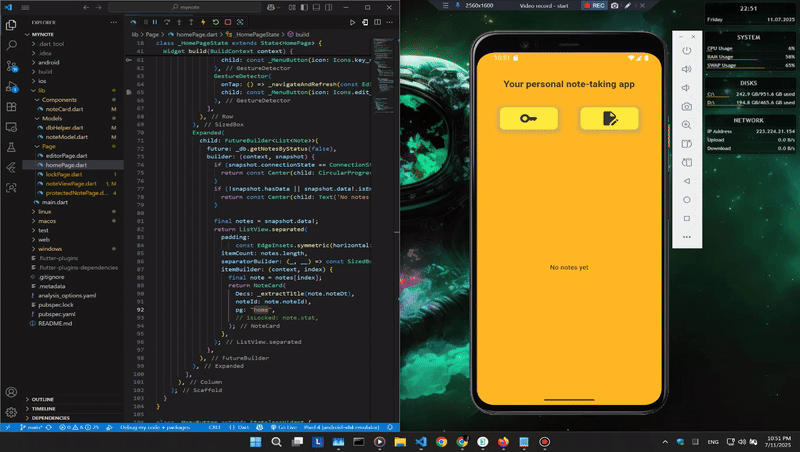

# 📝 Flutter Note App

A beautifully designed, secure, and simple **note-taking app** built with **Flutter**, using **Flutter Quill** for rich text editing and **SQLite** for local data storage.

<div align="center">
  
</div>

---

## ✨ Features

- 🖊️ Create rich-text notes using [Flutter Quill](https://pub.dev/packages/flutter_quill)
- 💾 Store notes locally using SQLite
- 🔐 Lock notes with a 4-digit PIN code
- 🔓 Unlock and view protected notes
- 🧠 Automatic title generation from content
- 📋 Clean and responsive UI

---

## 📦 Dependencies

| Package | Purpose |
|--------|---------|
| `flutter_quill` | Rich text editor |
| `sqflite`       | Local database (SQLite) |
| `path_provider` | File system paths |
| `flutter_localizations` | Localization support |

---

## 🚀 Getting Started

1. **Clone the repo**
   ```bash
   git clone https://github.com/kbimsara/myNote.git
   cd myNote
   cd myNote
   ```

2. **Install packages**
   ```bash
   flutter pub get
   ```

3. **Run the app**
   ```bash
   flutter run
   ```

---

## 📂 Project Structure

```
lib/
├── Components/
│   └── noteCard.dart
├── Models/
│   ├── dbHelper.dart
│   └── noteModel.dart
├── Page/
│   ├── editorPage.dart
│   ├── homePage.dart
│   ├── lockPage.dart
│   ├── noteViewPage.dart
│   └── protectedNote.dart
└── main.dart
```

---

## 🔒 Locking Logic

- Notes can be **locked** after saving.
- Locked notes require a **4-digit PIN** (default: `1234`) to access.
- Stored notes have a `stat` flag (`true` = locked, `false` = unlocked).

---

## 🎥 Demo



---

## 🙌 Credits

Developed by [Kavindu Bimsara](https://github.com/kbimsara)
